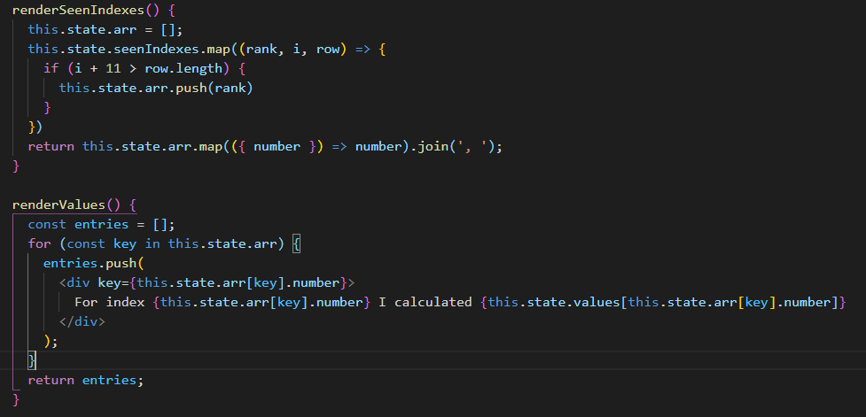
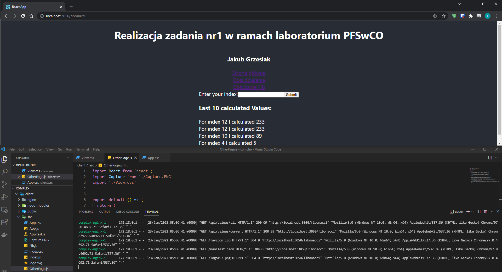

# -Realizacja-zadania-nr1-w-ramach-laboratorium-PFSwCO

<h3>Stworzona aplikacja opiera się o zadanie z laboratorium 9.</h3>
Funkcjonalność aplikacji zostałą rozszerzona o dodanie następujących rzeczy:
<ul>
  <li>Nowa podstrona</li>
  <li>Wyświetlanie 10 ostatnich wartości obliczeń z bazy danych</li>
  <li>Ograniczenie wprowadzenia liczby do 2</li>
</ul>
<h3>Opis działania</h3>

Stworzona aplikacja opiera się o model wielokontenerowy.<br>
Zgodnie z założeniami zadania użytkownik może skorzystać z 3 stron.<br>
Strona główna, strona z opisem oraz strona z obliczaniem ciągu.<br>

Do poprawnego działania aplikacji wymagane było zmodyfikowanie kodu do następujecgo stanu


Idea jest taka, że w metodzie renderSeenIndexes musimy do utowrzonej tablicy wprowadzić 10 wartości z bazy danych.<br>
Natomiast w renderValues tworzymy właściwe rekordy, które zostaną wyświetlone na stronie.

### Uruchomienie usługi
Do uruchomienia usługi należy użyć (w folderze z aplikacją) następującej komendy:
```bash
docker compose up --build
```
Do zatrzymania usługi: 
```bash
docker compose down
```
Działająca aplikacja:

